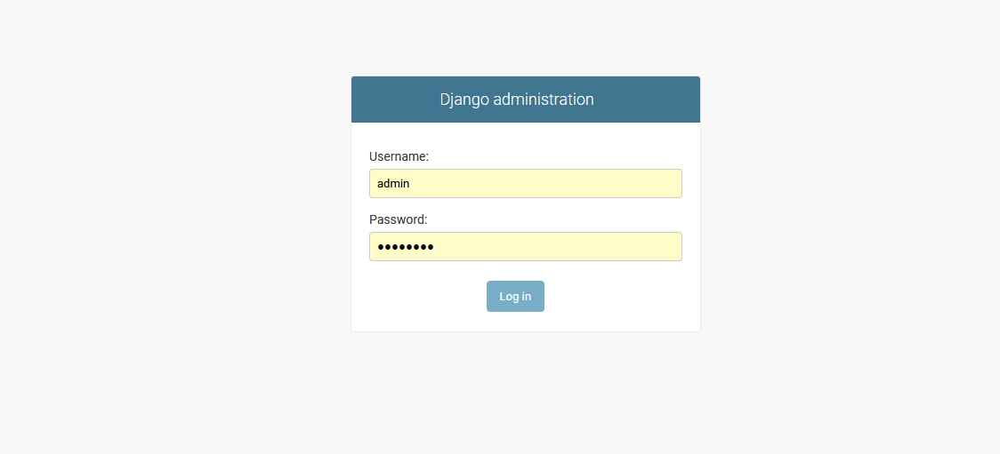
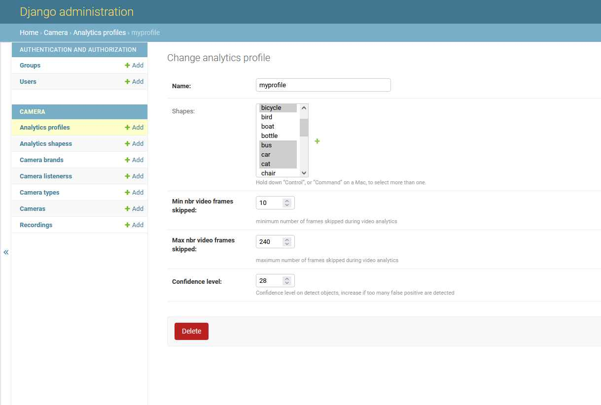
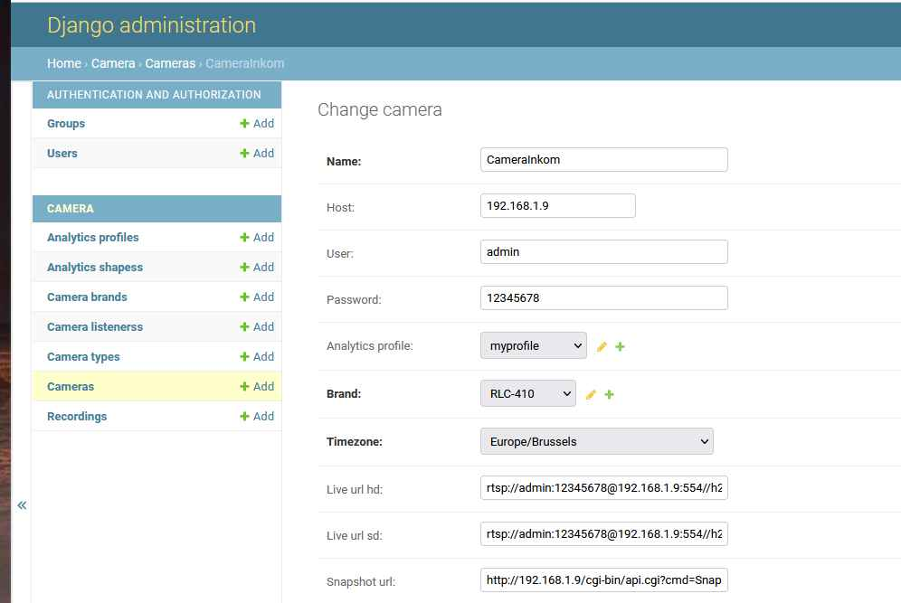
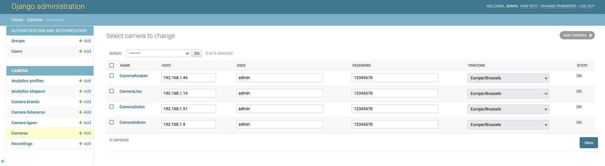
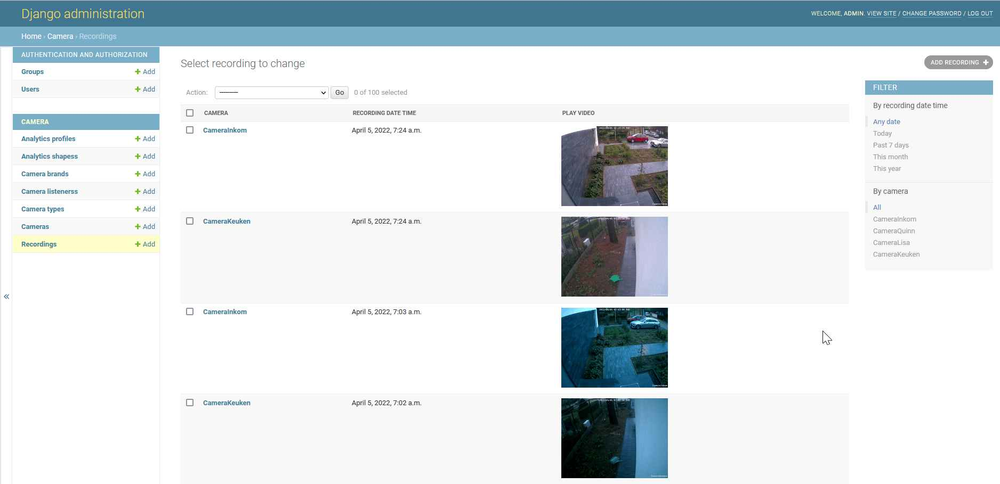
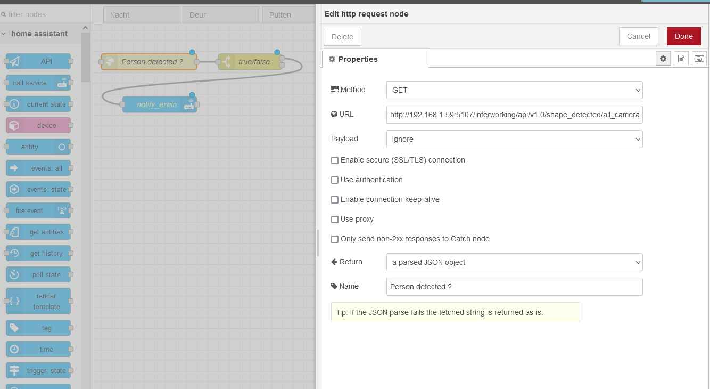

# Introduction
Concierge is an enhanced Video Management System offering the following features:
* Central configuration of camera settings
* Central collection/viewing of recordings
* Collect motion triggers from cameras
* Video analytics on recordings
  * Motion detection
  * Shape detections (e.g. car, person, ...) based on a profile (e.g. selection of objects of interest)
  * Face detection / reocognition
  * Object comparison
  * Covered camera detection
  * Loitering
  * ...
* Data collection of analytics and visualization
* Classification of objects (unknown faces, unknown objects) : identifies these persons and objects
* Integration with Home Assistant (Home automation system)
  * Motion events reporting , global and per camera
  * Shape events reporting, global and per camera (e.g. person detected)
  * Event reporting of Object classification :
    * Unknown persons (faces)
    * Unknow objects (car)
    * Known objects/persons + roles (trusted person, own car, car of delivery company, ...)

---
**note**

Concierge is currently under development/under test so not all of the above features are implemented yet.  Also, camera support is currently limited to Reolink RLC-410.


---
# Installation procedure
The current installation procedure is only guaranteed on Rasberry pi 4 / ubuntu 20.4.  Open a terminal after installation

```bash
sudo -i
apt-get update
apt-get -y ugrade
apt-get -y install git
git clone https://github.com/sprenge/concierge.git
cd concierge
chmod +x install/install.sh
cd install
./install.sh
# be patient while concierge is installing
reboot
```
Make sure that your rasberry pi and cameras have a fixed IP address (most of the home routers/gateway foresee this feature)

Edit the .env file and change at least the following variables :
- CONCIERGE_IP_ADDRESS=\<IP address of your raspberry pi in your home network\>.  The address 192.168.1.59 is used further in this document.  Replace it with the IP address of your own rasberry device.
- TIMEZONE=\<Your timezone\>

Other settings :
- ROOT_DIR : root directory used by concierge as storage

An example .env file looks like :

```bash
CONCIERGE_IP_ADDRESS=192.168.1.59
TIMEZONE=Europe/Brussels
ROOT_DIR=/camera
VERSION_FLASK=1.1.2
VERSION_FLASK_RESTFUL=0.3.8
VERSION_REQUESTS=2.22.0
PORT_DETECT_SHAPE_SNAPSHOT=5103
PORT_DETECT_SHAPE_VIDEO=5105
INFLUXDB_ADMIN_ENABLED=true
```

```bash
# start concierge
docker-compose up -d
# logs
docker-compose logs -f
# stop concierge
docker-compose down
```

Redirection of docker logs to syslog of the host machine : create /etc/docker/daemon.json and restart docker

```bash
{
  "log-driver": "syslog",
  "log-opts": {
    "syslog-address": "udp://192.168.1.59:514",
    "tag": "{{.Name}}"
  }
}
```

# Camera control

Open a browser and navigate to the following URL : http://192.168.1.59:8000/admin
Emter User / password django admin interface : admin/12345678



Only the django admin interface is currently forseen for configuring cameras and the ability to browse through recordings, a more enhanced interface will be foreseen in the future.

## Add an analytics profile record

Give a profile nane and select the objects you are interested in (Shapes).



## Add a camera to concierge

- Foresee host (fixed IP address of the camera) and the user/password of the camera
- Select profile (see previous step)
- Select timezone and brand
- Fill in live url hd/sd and snapshot url
- Save : the camera is configured and should get the OK status





## Consult the recordings



# Integrate concierge in home assistant

## Add last detected objects (persons, cars, ...)
Edit the configuration.yaml file (add simular config as indicated in the example below) and restart home assistant :

```bash
camera:
  - platform: generic
    name: "person0"
    still_image_url: "http://192.168.1.59:5107/interworking/api/v1.0/last_detected_images/person/0.jpg"
    framerate: 60
  - platform: generic
    name: "person1"
    still_image_url: "http://192.168.1.59:5107/interworking/api/v1.0/last_detected_images/person/1.jpg"
    framerate: 60
  - platform: generic
    name: "person2"
    still_image_url: "http://192.168.1.59:5107/interworking/api/v1.0/last_detected_images/person/2.jpg"
    framerate: 60
  - platform: generic
    name: "person3"
    still_image_url: "http://192.168.1.59:5107/interworking/api/v1.0/last_detected_images/person/3.jpg"
    framerate: 60
  - platform: generic
    name: "person4"
    still_image_url: "http://192.168.1.59:5107/interworking/api/v1.0/last_detected_images/person/4.jpg"
    framerate: 60
  - platform: generic
    name: "person5"
    still_image_url: "http://192.168.1.59:5107/interworking/api/v1.0/last_detected_images/person/5.jpg"
    framerate: 60

    Add these objects in lovelace cards after having restart home assistant.

    Persons are just an example, you can of course also other objects like cars (whatever you specified in your profile)
```

## Trigger an automation when an object is detected in node red

Example of an automation : send a push message to a phone when a person is detected



The full URL (not complete readable in the picture) : http://192.168.1.59:5107/interworking/api/v1.0/shape_detected/all_cameras/person

